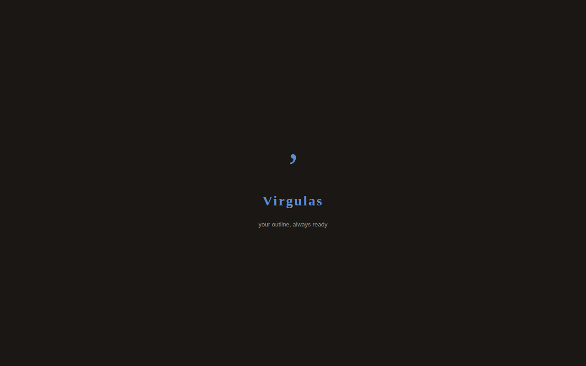

# Virgulas — Implementation Plan

## Screenshots

| Light mode | Dark mode |
|---|---|
|  |  |

## Purpose & scope

A keyboard-first infinite outliner running entirely in the browser.
No server, no build step, data lives in the browser (localStorage).
Export/import via Markdown.
Optional cloud sync via Supabase for signed-in users.

The source is split across a few small files:

```
source/
  index.html          HTML structure (no inline CSS or JS)
  style.css           All styles
  vendor/supabase.js  Vendored UMD build from @supabase/supabase-js
  js/
    model.js   Pure data model (makeNode, findNode, flatVisible, …)
    state.js   Mutable runtime state + localStorage persistence
    view.js    DOM rendering — reads state, writes DOM, no event handlers
    update.js  State-modifying operations (node CRUD, zoom, undo, search)
    sync.js    Supabase auth + cloud sync
    app.js     Entry point: event wiring (event delegation on containers)
```

---

## CI

There are two workflow files:

| Workflow | File | Trigger |
|---|---|---|
| **CI** | `ci.yml` | Push to `main`, pull requests, manual |
| **Daily Tests** | `daily-tests.yml` | Every day at 06:00 UTC, manual |

### CI (`ci.yml`)

Runs on every push to any branch (and on manual `workflow_dispatch`). Jobs are strictly sequential — no parallelism.

```
push (any branch)
  └─ test
       └─ deploy-db  [main only]
            └─ deploy  [main only]
```

**1 — `test` (E2E Tests)** — always runs. Installs Node 24, runs `npm ci` and `npm run test:install`, then executes `npm run test:ci` against both browsers. Supabase config is injected via `SUPABASE_PROJECT` and `SUPABASE_PUBLISHABLE_DEFAULT_KEY` environment variables (handled by Playwright's `globalSetup`). Uploads artifacts (`test-results/`, `playwright-report/`) with a 15-day retention policy and writes a pass/fail step summary.

**2 — `deploy-db` (Deploy DB Migrations)** — runs on `main` only, after `test` succeeds. Links to the Supabase project and calls `supabase db push` to apply any pending migrations. Protected by the `supabase-production` environment (add required reviewers there to gate deployments). Uses the `SUPABASE_ACCESS_TOKEN` repository secret.

**3 — `deploy` (Deploy to GitHub Pages)** — runs on `main` only, after `deploy-db` succeeds. Builds a combined `_site/` directory containing:

- `main` branch source at the site root (`/`)
- Every currently-open PR branch at `/preview/<safe-branch>/` (fetched via `gh pr list`)

Supabase config placeholders are substituted across all `state.js` files in `_site/`. The artifact is then deployed to GitHub Pages and the Cloudflare cache is purged. Because open PRs are enumerated at deploy time, stale previews for closed/merged branches disappear automatically — no separate cleanup step is needed.

Branch names are sanitised (non-alphanumeric characters replaced with `-`) before being used as URL path segments.

### Daily E2E tests (`daily-tests.yml`)

Runs every day at **06:00 UTC** (and on manual `workflow_dispatch`). Sets `BASE_URL=https://virgulas.com` so the Playwright suite runs directly against the live production site — no local server is started and no Supabase config injection is needed (the deployed site already has real values). Artifacts are uploaded with a 15-day retention policy under the name `daily-playwright-results`, and a pass/fail summary is written to the GitHub step summary.

---

## Deployment

Deployment is handled entirely by the `deploy` job in `ci.yml` (see the **CI** section above). There are no separate deployment workflows.

### Preview index page (`/preview/`)

`source/preview/index.html` is a standalone page deployed alongside the main app.
It calls the GitHub REST API to list all currently open pull requests for this repository and renders each one as a card with:

- PR title, number, author, and open date
- **Preview** button — links to the deployed preview at `/preview/<sanitized-branch>/`
- **View PR** button — links to the pull request on GitHub

---

## Tech decisions

- **Multi-file app** — HTML structure in `source/index.html`, CSS in `source/style.css`, and JavaScript split into ES modules under `source/js/`. Inspired by the Elm architecture (Model / Update / View).
- **Vanilla JS** — no framework. Direct DOM manipulation via a thin render layer; events handled with delegation.
- **Markdown** — a small hand-rolled inline parser (bold, italic, code, links, images). No external lib needed.
- **Supabase** — loaded from a local vendored file (`source/vendor/supabase.js`, generated from `@supabase/supabase-js@2` via npm). The app functions fully offline if Supabase is unavailable. Run `npm install` and `npm run vendor` to regenerate the bundle.

---

## Supabase cloud sync

Cloud sync is automatic for signed-in users — there is no separate toggle. When not signed in, the app works entirely offline using `localStorage`.

When sync is enabled and a user is signed in, the outline data and theme preference are synced to Supabase every 15 seconds.

### Infrastructure as code

The Supabase schema is managed via the **Supabase CLI** and lives under `supabase/`:

```
supabase/
  config.toml                              Supabase CLI project config (project_id, local dev settings)
  migrations/
    20240101000000_initial_schema.sql      Creates the `outlines` table and RLS policy
```

Whenever a file under `supabase/migrations/` is pushed to `main`, the `deploy-db` job in `ci.yml` automatically applies the pending migrations to the live project using `supabase db push`.

#### Required secret

Add a **`SUPABASE_ACCESS_TOKEN`** secret to the GitHub repository (Settings → Secrets → Actions). Generate a token at [app.supabase.com/account/tokens](https://app.supabase.com/account/tokens).

#### Running migrations locally

```bash
# Install the Supabase CLI (https://supabase.com/docs/guides/cli)
brew install supabase/tap/supabase   # macOS / Linux via Homebrew

# Link to the remote project (one-time setup)
supabase link --project-ref fpuoxiiedqmcfnjubicz

# Apply all pending migrations to the remote database
supabase db push
```

#### Adding a new migration

```bash
# Create a new timestamped migration file
supabase migration new <description>
# e.g. supabase migration new add_index_on_updated_at

# Edit the generated file under supabase/migrations/, then push to main
# The deploy-db job in ci.yml will deploy it automatically.
```

### Security considerations

Running database migrations from CI introduces several attack vectors. The ones relevant to this setup and how each is mitigated:

| Vector | Risk | Mitigation |
|---|---|---|
| **Mutable action reference** | `supabase/setup-cli@v1` points at a moving branch. If the upstream repo is compromised the next run executes attacker code with access to the token. | Action pinned to an immutable commit SHA (`b60b5899…`). Update the SHA deliberately when upgrading. |
| **`version: latest` binary download** | Downloads the most recent CLI release from GitHub Releases on every run. A CDN compromise or account takeover could serve a malicious binary. | Pinned to an explicit version (`1.6.0`). |
| **Unreviewed path to production** | Migrations reach `main` — and trigger `deploy-db` — as soon as a PR is merged, without any human reviewing the SQL unless an environment gate is configured. | The `deploy-db` job uses `environment: supabase-production`. Add required reviewers to that environment in GitHub Settings → Environments so no deployment proceeds without explicit approval. |
| **No deployment gate** | Without an environment, the workflow fires immediately on every qualifying push with no approval step. | Addressed by `environment: supabase-production` above. |
| **Parallel migration runs** | Two quick pushes to `main` could start two `supabase db push` processes simultaneously, risking duplicate migrations or migration-table corruption. | The top-level concurrency group uses `cancel-in-progress: false`, so a second run queues and waits for the first to finish rather than interrupting an active migration. |
| **Broad access token scope** | A Supabase personal access token grants access to **all projects** in the account, not just this one. A leaked token is account-wide. | Rotate the token regularly. Consider creating a dedicated Supabase account that owns only this project. The Supabase CLI does not support project-scoped tokens at this time. |
| **No rollback** | SQL migrations are irreversible by default. A destructive statement goes to production with no automated rollback path. | Review migration files carefully before merging. For destructive changes, test against a staging project first. Add rollback SQL as a new migration if needed. |

#### Enabling the environment gate (one-time setup)

After adding `environment: supabase-production` to the workflow, configure the gate in GitHub:

1. Go to **Settings → Environments → supabase-production**
2. Under **Deployment protection rules**, enable **Required reviewers** and add the people who must approve database deployments
3. Optionally set **Prevent self-review** so the PR author cannot approve their own migration

### Sync behaviour

- **Compression**: data is gzip-compressed with the native `CompressionStream` browser API before storing in Supabase to minimise storage and bandwidth.
- **Poll interval**: every 15 seconds (and immediately when the browser tab regains focus).
- **Version numbers**: each push increments `doc.version`, allowing the client to detect whether the server has newer data.
- **Sync indicator**: a small status label appears between the toolbar spacer and the Options button:
  - *Pending* — unsaved local changes waiting to be pushed.
  - *Syncing…* — network request in progress.
  - *Synced* — last sync completed successfully (fades after 3 s).
  - *Sync error* — network or server failure.
  - *Conflict – click to resolve* — clicking opens the conflict modal.
- **Sync algorithm** (runs every 15 s):
  1. If a server pull is pending user resolution, skip the tick entirely.
  2. Fetch the server version number (lightweight, no data download).
  3. If **server version ≤ local version**: push local data if there are pending changes; otherwise mark as *Synced*.
  4. If **server version > local version**: fetch the full server payload, pause further sync ticks, then either auto-merge or open the conflict modal. After a successful auto-merge the merged result is pushed immediately in the same tick.
- **Auto-merge**: when the server version is newer and there are local changes, a 3-way merge is attempted. If changes affect different nodes the merge succeeds silently: the merged result is applied locally and pushed to the server immediately.
- **Conflict modal**: if the same node was edited in both versions, the conflict modal opens showing the local and server Markdown side-by-side. Sync ticks are paused until the user resolves the conflict. Three resolution options are offered:
  - **Keep Local** — push the local version to the server (unpauses sync).
  - **Use Server** — replace local data with the server version (unpauses sync).
  - **Apply Resolved** — edit the pre-populated "Resolved version" textarea and apply it (unpauses sync).
- **Theme sync**: the active theme (light/dark) is included in the sync payload so it stays consistent across devices.
- **First sync**: on the first sync after signing in, if the server has no data and the client has local content it is uploaded automatically.

---

## Data model

```
Node {
  id:          string       // nanoid-style: random base36 + timestamp
  text:        string       // bullet title (inline markdown)
  description: string       // optional multiline note
  children:    Node[]       // ordered child nodes
  collapsed:   boolean      // whether children are hidden
}

Document {
  root:    Node             // invisible root; its children are top-level bullets
  version: number           // schema version for future migrations
}
```

The entire document is one JSON tree. The root node is never shown directly — it is the container for top-level bullets.

---

## State

Three pieces of mutable state

```
doc          — the Document object 
zoomStack    — array of node IDs, from root down to current view (url is source of truth)
focusedId    — ID of the bullet whose text is currently focused (or null)
selectedIds  — ordered array of IDs in the current multi-selection (empty when no selection)
selectionAnchor — ID of the node where the multi-selection started (null when no selection)
selectionHead   — ID of the node at the current end of the multi-selection (null when no selection)
syncEnabled      — (removed; login implies sync)
devMode          — boolean; whether the dev panel is visible (persisted in localStorage as 'dev_mode')
encryptionKey    — CryptoKey (AES-GCM 256-bit) derived from user's login password — held in memory only, never persisted to localStorage or sent to the server
```

---

## URL scheme

The zoom path is stored in the URL hash so the view survives a refresh and is bookmarkable.

```
#                         → root view
#/nodeId                  → zoomed into one level
#/nodeId/childId/...      → deeper zoom
```

Use `history.pushState` for zoom changes so back/forward work naturally. Use `history.replaceState` for everything else (e.g. minor state sync) to avoid polluting history.

---

## HTML structure

```html
<div id="splash">              <!-- fixed full-screen, z-index 9999, pointer-events:none; shown on first-ever load, auto-dismisses -->
  <svg class="splash-logo">   <!-- the Virgulas comma-twig SVG mark -->
  <div class="splash-name">   <!-- "Virgulas" wordmark in Georgia serif -->
  <div class="splash-tagline"><!-- short tagline -->
</div>

<div id="search-bar">          <!-- fixed top, hidden unless .visible -->
  <input id="search-input">
  <span id="search-count">
  <button id="search-close">
</div>

<div id="app">
  <div id="breadcrumb">        <!-- sticky, crumb links + separators, hidden unless .visible -->
  <div id="zoom-desc">         <!-- contenteditable, hidden at root -->
  <div id="bullets">           <!-- main tree + ghost row, rebuilt on every render -->
                               <!-- last child is always a .ghost-row: a faded "New item…" placeholder that is never persisted -->
</div>

<div id="toolbar">             <!-- fixed bottom -->
  <button id="btn-markdown">Markdown</button>    <!-- opens unified edit-as-markdown modal -->
  <span id="sync-indicator">                     <!-- sync status label (hidden when sync is off or not signed in) -->
  <button id="btn-options">Options</button>       <!-- opens options modal (theme, sign in, GitHub link) -->
  <span class="toolbar-hint">? for shortcuts</span>   <!-- click opens shortcuts modal -->
</div>

<div id="dev-panel">           <!-- fixed right sidebar, hidden unless dev mode is on -->
  <h3>Dev panel</h3>
  <div id="dev-panel-content"> <!-- populated by renderDevPanel(); updated on every render() and setSyncStatus() call -->
</div>

<!-- five modals, each a .modal-overlay.hidden wrapper -->
<div id="modal-login">      <!-- sign-in form: email + password fields, error message, Submit/Cancel buttons -->
<div id="modal-markdown">  <!-- editable textarea showing current outline as Markdown; Apply button imports changes -->
<div id="modal-shortcuts">
<div id="modal-options">   <!-- options: account (sign in / sign out / delete account), developer mode toggle, theme toggle, GitHub repo link -->
<div id="modal-conflict">  <!-- conflict resolution: local vs server Markdown diff + resolved textarea; Keep Local / Use Server / Apply Resolved buttons -->
```

### Bullet row DOM (produced by `buildRow`)

```
.bullet-row  [data-id="{id}"]  style="margin-left: {depth*20}px"
  .bullet-gutter               fixed 36px wide, vertically centred
    .collapse-toggle           14px, opacity:0, active class if has children
    .bullet-dot                22px, click = zoomInto
  .bullet-content
    .bullet-text               contenteditable div
    .bullet-desc-view          div, display:none unless .visible; shows truncated description (2 lines with CSS line-clamp)
    .bullet-desc               textarea, display:none unless .editing; shown while actively editing the description
```

---

## CSS architecture

Use CSS custom properties on `:root` for the entire palette and spacing:

```css
--bg, --surface, --border, --border-light
--text, --text-muted, --text-faint
--accent, --accent-light
--bullet
--hover, --selected
--danger
--font: Helvetica, Arial, sans-serif
--font-mono: "Courier New", Courier, monospace
--indent: 24px          /* defined in CSS but NOT used for row indentation; row margin-left is computed in JS as depth * 20px */
--radius: 4px
--toolbar-h: 42px
--search-h: 48px
--transition: 120ms ease
```

Dark mode is applied by setting `data-theme="dark"` on `<html>`. The `html[data-theme='dark']` selector overrides all colour custom properties with dark equivalents. The current theme is persisted in `localStorage` under the key `theme`. `applyTheme(theme)` sets the attribute and updates the toggle button label.

The splash screen (`#splash`) uses `var(--bg)` and `var(--accent)` so it automatically renders in the active theme. Since `applyTheme()` is called at the very start of `init()`, the theme is set before the splash becomes visible.

The sync indicator (`#sync-indicator`) uses modifier classes on the element itself: `syncing`, `synced`, `pending`, `error`, `conflict`. When none of these classes are present (or the `visible` class is absent) it is hidden. The `.sync-spinner` element uses a `@keyframes sync-spin` CSS animation for the rotating ring.

The dev panel (`#dev-panel`) is `position:fixed; right:0; top:0; bottom:0; width:320px` and is hidden (`.hidden` class) unless developer mode is active. `.btn-danger` follows the same structure as `.btn-primary` but uses `var(--danger)` as its background/border colour.

Key layout rules:

- `.bullet-row` — `display:flex; align-items:flex-start`. Depth applied as `style.marginLeft = depth * 20 + 'px'` in JS, not via the `--indent` CSS variable.
- `.bullet-gutter` — fixed `width:36px; height:28px; align-items:center`. Never changes with depth.
- `.bullet-dot` and `.collapse-toggle` — both `height:28px` to match gutter.
- `.bullet-content` — `flex:1; padding:5px 8px 5px 2px`. Text starts right after gutter. Font size scales by depth: depth 0 = 100%, depth 1 = 95%, depth 2+ = 90%.
- `.bullet-text` — `font-size:15px; line-height:1.6`.
- `.bullet-desc-view` — `font-size:0.867rem`, `line-height:1.25rem`, `color:var(--text-muted)`, `display:none` by default, `display:-webkit-box` with `-webkit-line-clamp:2` when `.visible` class present (truncates to 2 lines with "…"). Click to switch into edit mode.
- `.bullet-desc` — `font-size:0.867rem`, `line-height:1.25rem`, `color:var(--text-muted)`, `display:none` by default, `display:block` when `.editing` class present (textarea used while editing the description).
- `.bullet-img` — `display:block; max-width:100%; max-height:400px; border-radius:6px`. Rendered by `renderInline` for `` syntax. Block element so images appear on their own line below the bullet text.
- Indent guide line — `::before` on `.bullet-row` at `left:22px`, `display:var(--has-children, none)`.
- `.collapse-toggle` — `opacity:0`; revealed via `.bullet-row:hover .collapse-toggle.active`.

Input and textarea `font-size` must be `16px` to prevent iOS zoom (override `.bullet-desc` for its smaller display size only after content is committed, or accept 16px there too).

---

## Inline markdown renderer

Hand-rolled, order matters:

```js
function renderInline(text) {
  return text
    .replace(/&/g, '&amp;').replace(/</g, '&lt;').replace(/>/g, '&gt;')
    .replace(/\*\*(.+?)\*\*/g, '<strong>$1</strong>')
    .replace(/\*(.+?)\*/g, '<em>$1</em>')
    .replace(/`(.+?)`/g, '<code>$1</code>')
    .replace(/!\[([^\]]*)\]\(([^)]+)\)/g, '')
    .replace(/\[(.+?)\]\((.+?)\)/g, '<a href="$2" target="_blank" rel="noopener">$1</a>');
}
```

Applied only on blur. While editing, raw text is shown.

Images are rendered as block elements (`.bullet-img`) below the bullet text. The image pattern is matched before the link pattern to avoid misidentifying `` as a link.

---

## Keyboard handling

`handleBulletKey(e, node)` is attached to `.bullet-text keydown`. Check shortcuts in this priority order:

| Priority | Action           | Default key        | Notes |
|----------|------------------|--------------------|-------|
| 0        | `unfocus`        | `Escape`           | Blur bullet; clears multi-selection |
| 0b       | `selectUp`       | `Shift+↑`          | Extend multi-selection upward |
| 0c       | `selectDown`     | `Shift+↓`          | Extend multi-selection downward |
| 1        | `toggleDesc`     | `Shift+Enter`      | Show/focus desc; from desc, return to text |
| 2        | `collapse`       | `Ctrl+Space`       | toggle collapsed/expanded node |
| 3        | `zoomIn`         | `Alt+→`            | zoom into node   |
| 4        | `zoomOut`        | `Alt+←`            | zoom out of node |
| 5        | `moveUp`         | `Alt+↑`            | move node (or entire selection) up   |
| 6        | `moveDown`       | `Alt+↓`            | move node (or entire selection) down |
| 7        | `indent`         | `Tab`              | indent node (or all selected nodes)    |
| 8        | `unindent`       | `Shift+Tab`        | unindent node (or all selected nodes)  |
| 9        | `newBullet`      | `Enter`            | Create new bullet |
| 10       | `deleteNode`     | `Ctrl+Backspace`   | Delete node; if multi-select, deletes all selected nodes. Confirmation if any deleted node has children |
| 10b      | `copyMarkdown`   | `Ctrl+C`           | When multi-select active: copies selected bullets as Markdown to clipboard and shows "Markdown copied" toast |
| 11       | `deleteEmpty`    | `Backspace`        | Only on empty bullet (text and description both empty); confirmation if has children |
| 12       | `focusPrev`      | `ArrowUp`          | focus previous visible node; clears selection |
| 13       | `focusNext`      | `ArrowDown`        | focus next visible node; clears selection |
| 14       | `shortcuts`      | `?`                | show shortcuts (only when bullet text is empty) |
| 15       | `search`         | `Ctrl+F`           | focus search input |
| 16       | `undo`           | `Ctrl+Z`           | undo last structural change |

A global `keydown` listener handles `Escape` to close any open modal or the search bar, and handles `Enter` (unfocused, focuses the ghost row at the bottom), `Ctrl+F` / `?` / `Ctrl+Z` when no editable element is focused. It also handles `ArrowDown` (focus first visible node) and `ArrowUp` (focus last visible node) when no item is focused.

## Touch / mobile handling

Each `.bullet-row` has `touchstart` / `touchend` listeners for swipe-to-indent:

- **Swipe right** (horizontal delta > 50 px, horizontal > 2× vertical) → `indentNode` (same as `Tab`).
- **Swipe left** (horizontal delta < −50 px, horizontal > 2× vertical) → `unindentNode` (same as `Shift+Tab`).

Both listeners are registered as `{ passive: true }` so they do not block scrolling.

---

## Description behaviour

- `.bullet-desc-view` is a `<div>` shown when `node.description` is non-empty; it uses CSS `-webkit-line-clamp: 2` to show at most 2 lines with "…" overflow. Click on it to start editing.
- `.bullet-desc` is a `<textarea>` shown (`.editing`) while the user is actively editing the description; hidden otherwise.
- `Shift+Enter` from `.bullet-text` → show textarea (`.editing`), hide view, focus textarea, cursor to end.
- `Shift+Enter` or `Escape` from textarea → blur textarea, refocus `.bullet-text`. The view div is then shown if `node.description` is non-empty.
- On textarea blur: if `node.description` is empty, both view and textarea are hidden.
- Auto-resize on input: `el.style.height = 'auto'; el.style.height = el.scrollHeight + 'px'`.
- Description font is always smaller than bullet text (0.867rem), with a line-height of 1.25rem.
- When zoomed into a node, `#zoom-desc` is a `contenteditable` div. `Shift+Enter` from `#zoom-desc` focuses the first bullet; `Escape` zooms out.

---

## Zoom behaviour

- `#zoom-desc` is a `contenteditable` div, hidden at root zoom level. It is editable while zoomed in; changes are saved on blur and the breadcrumb is re-rendered.
- On `zoomInto()`: after render, `requestAnimationFrame` → focus on first child, or create an empty one if none exists.
- `Alt+←` from any top child node → `zoomOut()`.

---

## Import / Export

A single **Markdown** toolbar button opens the unified `#modal-markdown` modal.

The modal textarea is pre-populated with the current outline in Markdown format (same as the old export). The user can freely edit the Markdown text, then click **Apply** to replace the entire document with the parsed Markdown (same parser as the old import). Clicking **Cancel** discards any edits. The zoom stack is reset on Apply.

**Markdown format:**

```
- Bullet text
  > description line
  - Child bullet
+ Collapsed bullet
  - Hidden child
```

Recursive, depth increases indent by two spaces per level. Lines matching `/^(\s*)([-*+])\s(.*)$/` are bullets. Indent depth determines parent via a stack. Lines matching `/^\s*>\s(.*)$/` append to the last node's description.

The bullet character encodes collapsed/expanded state:
- `-` (or `*`) → expanded (children visible)
- `+` → collapsed (children hidden)

---

## Undo

`undoStack` is an in-memory array of serialised doc snapshots (max 100 entries).

- `pushUndo()` is called **before** each mutation: `newBulletAfter`, `deleteNode`, `indentNode`, `unindentNode`, `moveNode`, collapse toggle, and Apply in the Markdown modal. It is also called on focus of `.bullet-text` and `.bullet-desc` so that text/description edits are undoable.
- `undo()` pops the latest snapshot, restores `doc`, saves to localStorage, validates `zoomStack`, and re-renders.
- `Ctrl+Z` triggers `undo()` from both the bullet keydown handler and the global keydown handler (when no element is focused).

---

## Authentication

Authentication is provided by [Supabase](https://supabase.com), loaded from the CDN.

- The `#auth-ui` container inside `#modal-options` is populated dynamically by `renderAuthUI(user)`.
- On load, `initAuth()` synchronously shows the **Sign in** button, then asynchronously fetches the active session and updates the UI.
- Clicking **Sign in** opens `#modal-login`, which supports two modes: **Sign in** and **Sign up**.
- The modal starts in Sign-in mode. A "Don't have an account? Sign up" link toggles to Sign-up mode, which shows an additional **Confirm password** field.
- In Sign-up mode, submitting the form calls `supabaseClient.auth.signUp({ email, password })`. On success, a "Check your email for a confirmation link." message is shown (Supabase sends a confirmation email by default; this can be disabled in the Supabase Auth settings).
- In Sign-in mode, if the local document has content, a confirmation dialog warns that local data will be replaced by the server version. Then the form calls `supabaseClient.auth.signInWithPassword({ email, password })`. On success, the encryption key is derived from the password, the password is stored in `localStorage` (under `encryption_password`), server data is pulled and replaces local data, and `startSync()` begins the 15-second sync loop.
- If the Supabase CDN is unavailable, the **Sign in** button is still shown, and submitting the form shows an "Authentication service unavailable." error.
- No changes to the Supabase project are required to enable sign-up — email/password sign-up is enabled by default.
- On sign-out, **all `localStorage` data is cleared**, the document is replaced with seed data, the theme is reset to light, and the UI is re-rendered. This ensures a clean state for the next user.
- A signed-in user also sees a **Delete account** button (styled with `.btn-danger`). Clicking it shows a confirmation dialog, then deletes the user's row from the `outlines` table and performs a full sign-out (clear + seed).

---

## Client-side encryption

Encryption is used **only for server sync** — data synced to the cloud is always encrypted end-to-end. **localStorage stores plain JSON** and is never encrypted.

The encryption key is derived automatically from the user's login password — there is no separate passphrase modal.

- **Algorithm**: AES-GCM 256-bit. Keys are derived from the user's password using PBKDF2 (600 000 iterations, SHA-256). All cryptographic operations use the browser's built-in `window.crypto.subtle` (Web Crypto API) — no external library is needed.
- **Key derivation**: On successful sign-in, the encryption key is derived from the password using a random 32-byte salt. The key is held in memory only — it is **never** written to `localStorage` or sent over the network. On sign-out, the key is cleared.
- **Salt**: A random 32-byte salt is generated on first sign-in and stored in `localStorage` under `encryption_salt` (base64). The salt is also stored on the server (in the `outlines` table's `salt` column) so it can be recovered when signing in on a new device. The salt is not secret and is required to re-derive the same key on subsequent sign-ins.
- **Ciphertext format**: the 12-byte IV is prepended to the AES-GCM ciphertext; both are encoded together as a single base64 string. `decrypt()` validates that the combined blob is longer than 12 bytes before attempting decryption.
- **Document storage**: `saveDoc` / `saveDocLocal` always write **plain JSON** to `localStorage`. No encryption is applied to local storage.
- **Cloud sync**: the Supabase sync payload is first gzip-compressed (`compressData`) and then AES-GCM encrypted before being stored in the database. On pull, the payload is decrypted then decompressed. If the server holds unencrypted data (uploaded before encryption was enabled), decryption fails gracefully and the payload is decompressed directly.

---

## Search

- Fixed bar at top (`display:none` normally, `display:flex` when active via `.visible` class). When open, `#app` receives the `search-open` class to add top padding.
- `Ctrl+F` opens it and focuses the input.
- On input: walk the entire `doc.root` tree (not just current zoom), collect matching IDs, show count, focus first match. Matches on **both** `text` and `description` fields.
- `Enter` cycles through matches.
- `Escape` closes and clears, then focuses the last highlighted match.

---

## Seeded initial data

On first load (empty document), seed with six tip bullets (one of which has two children) to demonstrate nesting, zoom, descriptions, and other features. Every seed bullet includes a description so the description feature is immediately visible. This gives users an immediate working example without any setup.

The seed data is immediately persisted to `localStorage` (via `saveDocLocal()`) so the seeded state survives a refresh even if the user makes no edits. On subsequent loads `loadDoc()` finds the stored document and `seedDoc` is not called again.

The seed data in Markdown format:

```
- Press **Enter** to create a new bullet
  > A new bullet is inserted immediately after the current one at the same depth. The cursor moves to it automatically so you can start typing right away.
- Use **Tab** and **Shift+Tab** to indent and unindent
  > Tab makes the current bullet a child of the bullet above it. Shift+Tab promotes it one level up. On mobile, swipe right to indent and swipe left to unindent.
- Use **Alt+↑/↓** to move bullets up and down
  > Reorders siblings without changing their depth or children. Use Ctrl+Space to collapse or expand a bullet's children.
  - Alt+→ to zoom into any bullet
    > Zooming focuses the view on a single node and its subtree. The breadcrumb bar at the top shows your current path and lets you navigate back up.
  - Alt+← to zoom back out
    > Returns to the parent level. You can also click any crumb in the breadcrumb bar.
- Press **Shift+Enter** to add a description to any bullet
  > Descriptions appear below the bullet text in a smaller muted font. Press Shift+Enter or Escape from the description to return to the bullet text. Click the description preview to edit it again.
- Use `Ctrl+F` to search your entire outline
  > Search matches both bullet text and descriptions across the whole document, not just the current zoom level. Press Enter to cycle through matches, Escape to close.
- Use `Ctrl+Z` to undo and the **Markdown** button to export
  > Undo reverses the last structural change (create, delete, move, indent). The Markdown toolbar button opens a live editor showing your full outline — edit it directly and click Apply to import changes.
```

---

## Logo, splash screen & PWA icons

### Logo design

The Virgulas mark is a stylised **comma-twig** — combining the two meanings of the word *virgula*:
- **Comma** (Portuguese) — the overall shape is a comma: a leaf-like head with a curved descending tail.
- **Twig** (Latin) — the head is drawn as an organic botanical leaf/bud, and the tail flows like a plant stem.

The mark is defined as an inline SVG path with no external images required. It uses the app's accent colour (`--accent`) so it automatically adapts to the current theme (light/dark).

### Files

| File | Purpose |
|------|---------|
| `source/icon.svg` | Standalone SVG app icon used for favicon, PWA icons, and Apple touch icon |
| `source/manifest.json` | Web App Manifest enabling "Add to Home Screen" / PWA installation |

### `<head>` metadata

```html
<link rel="icon" type="image/svg+xml" href="icon.svg">
<link rel="apple-touch-icon" href="icon.svg">
<link rel="manifest" href="manifest.json">
<meta name="theme-color" content="#2a5caa">
```

### Splash screen

A full-screen overlay (`#splash`) is shown **on the very first load** (when no `localStorage` data exists yet). It displays:
1. The SVG comma-twig logo mark (96 × 96 px)
2. The word-mark "Virgulas" in Georgia serif
3. A short tagline

Behaviour:
- The overlay has `pointer-events: none` at all times so it never blocks interaction with the underlying UI.
- It auto-dismisses: 800 ms after `init()` completes, it begins a 700 ms `opacity` fade-out, then receives the `.hidden` class (`display:none`).
- On subsequent page loads (when `localStorage` already contains data), the overlay starts with the `.hidden` class and is never shown.

---

## Known edge cases to handle

- `indentNode` when `idx === 0` → no previous sibling, do nothing.
- `unindentNode` when parent is the current zoom root → do nothing.
- `unindentNode` moves the node to after its parent and all of the node's subsequent siblings are re-parented as children of the unindented node (so the visual order is preserved and no siblings are lost).
- `unindentNodes` (multi-select) does NOT adopt subsequent siblings — only the explicitly selected nodes are promoted.
- `deleteNode` when it is the only child → focus parent.
- `deleteNode` when node has children → show a `window.confirm()` dialog before proceeding.
- `deleteNodes` (multi-select) deletes in reverse flat order so index shifts don't affect subsequent deletions; shows a single confirmation dialog if any selected node has children.
- `copySelectionAsMarkdown` (multi-select `Ctrl+C`) exports selected nodes at depth 0 via `exportMarkdown`; shows a "Markdown copied" toast on success.
- `Ctrl+C` is only intercepted when `selectedIds.length > 1`; single-node copy falls through to the browser default.
- `zoomStack` IDs from hash that no longer exist in doc → filter them out on load (also after undo).
- Re-render must not steal focus from an actively-edited element — check `document.activeElement` before calling `focusNode`.
- `matchShortcut` for `Ctrl+Space`: `e.key === ' '` not `'Space'`.
- `renderZoomTitle` must guard against overwriting content while the element is focused.
- Backspace delete must check both `text === ''` and `description === ''` to avoid accidental deletion of nodes with only a description.
- Multi-select (`selectedIds`) is cleared on direct bullet click/focus (via `_keepSelection` flag), on regular ArrowUp/Down, and on Escape.
- `moveNodes` requires all selected nodes to share the same parent and be contiguous; if not, the operation is a no-op.
- `indentNodes` processes nodes top-to-bottom so successive siblings all pile into the same previous sibling in order.
- `_keepSelection` flag prevents the focus event from clearing the selection when `extendSelection` programmatically focuses the selection head.
- `moveNodes` sets `_keepSelection = true` when restoring focus to `selectionHead` after render, so that the selection persists across multiple consecutive multi-select moves.
- Ghost row `Backspace` on empty text navigates to the last visible bullet (same as `ArrowUp`), so keyboard users can move back up without switching to a different key.
- `saveDoc()` marks `pendingSync = true` and updates the sync indicator; `saveDocLocal()` is the internal variant used during sync operations that must not trigger another push.
- `tryAutoMerge` returns `null` if any node was edited differently in both local and server versions; only call it when `lastSyncedDocJson` is available (i.e. after the first successful sync).
- `zoomStack` must be re-validated against the restored doc after a pull or merge — use `zoomStack = zoomStack.filter(id => !!findNode(id))`.
- `CompressionStream` / `DecompressionStream` are available in Chrome 80+, Firefox 113+, Safari 16.4+. The decompressData fallback attempts plain base64-encoded JSON for robustness.
- `syncEnabled` must be checked both in `initAuth()` (on session restore) and in `onAuthStateChange` (on sign-in) before calling `startSync()`, so users who have not opted in never trigger a sync. (NOTE: `syncEnabled` was removed; login now implies sync.)
- The dev panel (`#dev-panel`) is refreshed on every `render()` call and every `setSyncStatus()` call when `devMode` is `true`. `countNodes(root)` is a simple recursive counter used by `renderDevPanel()`.
- `renderInline` matches `` (images) before `[text](url)` (links) — the image pattern must stay first so `` is not accidentally matched as a link. Reversing the order would break image rendering.
- `renderInline` processes text sequentially; patterns applied earlier can modify the string before later patterns run. Code spans (`` ` `` backtick) are processed before images, so image syntax inside inline code is intentionally converted to `<code>` before the image regex runs — this means you cannot display a literal `` as code in a bullet (it would render as a `` inside `<code>`).
