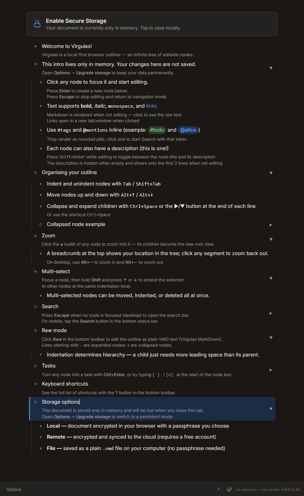

# Virgulas

[Virgulas](https://virgulas.com) is a local-first browser outliner.



## Features

- Infinite list of editable nodes with recursive children
- Markdown rendering (bold, italic, links, images, inline code); markdown links always open in a new tab/window. Images load inline with `referrerpolicy="no-referrer"` and no event handlers
- Inline `#tags` and `@mentions` are highlighted and clickable; tapping/clicking one opens Search with that token
- Optional description field per node (auto-growing textarea when editing)
- Node collapse/expand (button click or `Ctrl+Space`)
- Multi-select with `Shift+↑/↓`; `Delete`, `Tab`/`Shift+Tab`, `Ctrl+Space` all work on selection
- Node indent/unindent (`Tab` / `Shift+Tab`), plus mobile swipe right/left to indent/outdent; swipe does not change focus
- Node move (`Alt+↑` / `Alt+↓`)
- Node delete (`Ctrl+Backspace` or `Backspace` on empty node); `Backspace` on non-empty node deletes the character (normal text editor behaviour)
- Zoom into a node (`Alt+→`) with breadcrumb navigation
  - Zoomed node description is visible and editable with placeholder when empty
  - Zoomed node with no children shows an empty state to create the first child
  - Empty root document shows an empty state to create the first node
- Search: substring match, `Tab`/`Shift+Tab` or `↑`/`↓` cycles results, pressing `Enter` or clicking a result zooms to the match; current result highlighted distinctly; mobile includes a status-bar Search button
- Node typography hierarchy (root 1rem, level 2 0.9rem, level 3+ 0.85rem)
- Distinct focus style (accent background + left border) separate from hover style
- Theme toggle (light/dark) persisted in localStorage
- Bottom-sheet lock screen flow with advanced mode switching:
  - **Local** 🔒 — passphrase-only create/unlock; data encrypted in localStorage; new document starts with one empty node
  - **Remote** 🔒 — account email + password + encryption passphrase; encrypted cloud sync via Supabase
  - **Filesystem** 📄 — open/create a local `.vmd` file via File System Access API; no encryption, no passphrase; new empty file gets one initial node
  - **Change mode** reveals the Local/Remote/File selector and full auth form
- **Memory mode** (first-ever visit): on the very first visit the app skips the lock screen entirely
  - The document lives only in JS memory and is lost when the tab is closed or reloaded
  - A built-in intro document (`intro.vmd`) is loaded automatically to walk new users through every feature; if the fetch fails an empty node is provided
  - An inline **Enable Secure Storage** prompt appears above the outline and opens the bottom-sheet setup flow
  - The status bar shows an *In memory — not saved* badge
  - The Options panel hides the **Upgrade storage…** and **Delete local data** actions in Memory mode — the persistent upgrade is offered by the **Enable Secure Storage** banner, and there is no local data to purge
  - The most recently used mode (including Memory) is remembered and shown as the default on the next visit
  - Choosing **"Skip — continue in memory"** on the lock screen (or signing out) loads the app in Memory mode and remembers it, so the next visit boots straight into memory without a lock screen until the user selects a persistent mode
  - When the app is locked, the main canvas remains visible in a blurred state using `intro.vmd` as background context until unlock
- Status toolbar shows the current storage mode; in Remote mode it also shows the signed-in email/username
- Lock screen clearly labels encryption status per mode; Remote mode has separate Sign in / Create account tabs
- Destructive mode switches (clearing local data, signing out) require confirmation
- Optional cloud sync via Supabase (end-to-end encrypted)
  - Pull-before-push: before every write, the remote `updated_at` timestamp is checked; if the remote is newer the doc is fetched and merged before uploading
  - Per-node `lastModified` timestamps drive node-level merge: one-side-only changes are applied silently; same-node different-field changes are also auto-merged
  - Conflict resolution when the same field is edited on both sides: a blocking modal shows each conflict side-by-side with "Keep local" / "Keep remote" per field and "Use all local" / "Use all remote" bulk buttons; "Apply" is disabled until every conflict is resolved
  - Remote sync waits until typing pauses before checking or uploading, so active typing supersedes stale background sync attempts
  - 60-second background polling checks for remote updates while the app is open; it defers remote checks while local edits are still active and pauses when conflicts are pending
- Task management: any node can become a task
  - Task nodes keep their bullet (click to zoom) and show a checkbox after it; clicking the checkbox toggles pending ↔ done
  - Create/remove task state by editing the node text: type `[ ] ` / `[x] ` at the start, or delete the prefix to return to a plain node
  - `Ctrl+Enter` cycles task state: plain → pending → done → plain
  - Due dates: `due:yyyy-MM-dd` metadata renders as a chip in the node text and a badge in the Tasks sidebar; overdue tasks are highlighted and sorted first
  - Recurrence: `rec:<n><y|m|w|d>` metadata (e.g. `rec:1m`) only takes effect on a task that also has a `due:` date. Checking a recurring task's checkbox (mouse or `Ctrl+Enter`) advances its due date to the next occurrence instead of marking it done; month/year steps keep the same day, clamped to the end of the month when needed
  - Tasks panel (`Ctrl+Alt+K` or checklist toolbar icon): Pending, Scheduled, and Done groups, scoped to the current zoom, with breadcrumb context; click a row to zoom to that node
    - Pending: no due date, or due today/overdue. Scheduled: due date in the future, with a day-window filter (3d/7d/30d/All, default 3d) to hide distant tasks
  - Task state is preserved in Local/Remote JSON and in File mode (`.vmd`) via `[ ]` / `[x]` prefixes

- Keyboard shortcuts modal (`?` button) — desktop only (hidden on mobile)
- Options modal: theme toggle, source link, mode-specific session action (Sign out / Lock / Change file), purge data; the top summary row shows the storage mode and encrypted blob size with short encryption details (AES-GCM-256, PBKDF2 600k, random salt), and email, account password, and encryption passphrase are edited inline in that same row
- **Quick capture inbox:** text shared to Virgulas, sent to `/?quick-add=...`, or captured with the bookmarklet is held in an unencrypted, device-local queue and filed under a configurable root-level Inbox node after secure storage is unlocked; the web app manifest also exposes a Quick capture shortcut. A capture visit never boots the app or prompts for unlock — see below.
- `Enter` on a collapsed node with children creates a sibling, not a child

## Quick capture

Virgulas can receive text without a native Android wrapper or Play Store installation. **Options → Quick capture** lists these entry points in the app itself:

- Use the installed PWA's **Quick capture** long-press shortcut and type or dictate the text.
- Share text from another Android app to Virgulas through the Android share sheet.
- Open `https://virgulas.com/?quick-add=buy%20milk` (URL-encode the text) from an automation tool such as Tasker.
- Drag or copy the **Save to** bookmarklet from Options, then click it on any page. Note that bookmarklets are subject to the target page's Content-Security-Policy, so some strict sites (GitHub, X) will block them — use the app shortcut or share sheet there.

A captured page is stored as a markdown link: the node text becomes `[title](url)` and any highlighted text becomes that node's **Description**. A share payload without a title or URL falls back to using the text as the node text, and a value that merely repeats the URL or title is not duplicated into the description.

A capture visit **stays locked**. It performs no key derivation, no decryption, no network request and never triggers the biometric prompt — it only appends to the queue. The browser closes the capture window itself when it is allowed to (for example the bookmarklet popup); otherwise a minimal "Saved to the Inbox queue" confirmation is shown.

Captured text is stored temporarily in `localStorage` under `vmd_inbox_queue`. This queue is intentionally **unencrypted and device-local**; it is never synced. On the next unlock of Local, Remote, or File storage, Virgulas creates (or reuses) the configured root-level Inbox node, moves queued entries into it in order (text and description), and clears the queue. Memory mode leaves the queue pending until persistent storage is unlocked.

The target node name is configurable under **Options → Quick capture → Inbox node name**. Changing the setting affects future captures; it does not rename an existing node.

## Security

- **Pinned third-party analytics.** The only external script is the Umami tracker. It is loaded with a `sha384` subresource-integrity hash and `crossorigin="anonymous"` and is the sole host allowed by `script-src`, so the analytics host cannot silently ship different code — a new Umami build must be re-hashed deliberately (README → this section). Everything else is bundled at build time. A strict `Content-Security-Policy` (`script-src 'self' https://um.vps.pitermarx.com`, `object-src 'none'`, `base-uri 'none'`, `frame-src 'none'`) is declared in `index.html` with no inline script. `connect-src` in the source shell allows localhost and the `*.supabase.co` wildcard for development; production builds (`bun run build`) replace both with the concrete Supabase origin from `sync.ts` (`--supabase-url` / `SUPABASE_PROJECT` / `SUPABASE_URL` can override), so the deployed artifact can only reach that one project. `bun run dev` and `dev:test` keep the local sources. `frame-ancestors`/HSTS/X-Frame-Options/Referrer-Policy cannot be set from a meta tag and must be configured at the host/CDN.
- **Zero-knowledge sync.** Documents are gzip-compressed and encrypted with AES-GCM-256 under a key derived from your passphrase (PBKDF2-HMAC-SHA256 at 600,000 iterations, per-document random salt, random IV per write). The iteration count is recorded in the payload envelope (`v2:<iterations>:<base64>`), so it can be raised without breaking existing documents: pre-`v2` payloads still decrypt at 310k and are re-encrypted with the current parameters on the next save. The derived key is cached for the unlocked session so autosave does not re-run the KDF. Only `salt` + ciphertext leave the device; the server never sees plaintext.
- **New passphrases must be at least 10 characters.** Existing shorter passphrases still unlock — only newly chosen ones are checked (create, reset, and change flows).
- **Markdown sanitisation.** Rendered markdown is sanitised with an explicit allow-list (`strong, em, a, img, code, br`). Raw HTML cannot inject layout, forms, styling, ids, or classes into app chrome.
- **Hardened remote images.** Images load normally. Every rendered image (markdown or raw HTML) drops any `src` that is not http(s) or same-origin relative, and is loaded with `referrerpolicy="no-referrer"`, `loading="lazy"`, and `decoding="async"`; the sanitizer strips event handlers and `srcset`. The image host can still see your IP/user-agent, which is inherent to any remote image — use a proxy or blocker if that matters to you.
- **Encrypted passphrase for biometric unlock** is sealed on-device in IndexedDB behind WebAuthn user verification. Signing out, switching storage mode, and deleting local data all revoke that seal, so a shared device cannot recover the passphrase after a session ends. It is still a convenience gate rather than a hardware key binding — see `source/js/biometrics.ts` for the documented limitations.
- **No source maps in the deployed bundle.** `bun run build` and the deploy pipeline build with `--no-sourcemap` (and CI fails if `dist/js/app.js.map` appears); `bun run dev` keeps them for local debugging.
- **Supabase client test seam.** E2E specs can substitute the Supabase client through `window.supabase`, but that seam is compiled out of production builds via the `__TEST_HOOKS__` build flag, so a same-origin script cannot hijack sign-in or the session token.

## Setup

1.  Install dependencies:
    ```bash
    bun install
    ```

2.  Run locally (builds `dist/` and serves it):
    ```bash
    bun run dev
    ```

  `bun run dev:test` is the same build with the `__TEST_HOOKS__` seam enabled; Playwright uses it automatically to install its mock Supabase client. Production builds (`bun run build`) leave the seam off.

  `bun run build` bundles `source/js/app.ts` and the `source/css/*.css` modules into
  `dist/js/app.js` + `dist/js/app.css`, and stamps the version into `dist/index.html`
  and `dist/version.json`. Dependencies are resolved from `node_modules` at build time;
  there is no `source/vendor/` tree.

  Offline support notes:
  - A service worker (`source/sw.js`) caches assets in two buckets so the app works offline after the first successful load:
    - **Fonts & icons cache** — `source/fonts/` and `source/media/` files; served **cache-first**
    - **App cache** — `index.html`, `version.json`, `js/app.js`, `js/app.css`; served **stale-while-revalidate**
  - Cache version constants in `sw.js` are bumped automatically by `scripts/bump-sw-caches.mjs`, which hashes each file group and increments only the versions whose files have changed
  - `bun install` runs the bump script automatically
  - For app/font/icon changes, run `bun run sw:bump` before committing, or install Git hooks (`bun run sw:hooks`) to run `sw:bump` on push and validate Conventional Commit headers on commit

  The app reads Supabase settings from `localStorage.supabaseconfig` and seeds it automatically on first run with hosted defaults:
  - `url`: `https://gcpdascpdrakecpknrtt.supabase.co`
  - `key`: `sb_publishable_9Uxo-0GD-21K6mUPQ2FSuw_mDO06TJc`

  To point the browser to local Supabase, set `localStorage.supabaseconfig` to a JSON object with `url` and `key`.

3.  Run tests:
  ```bash
  bun run test
  ```
  `bun run test` runs both suites in sequence (always executes both; exits non-zero if either fails):
  - E2E Playwright specs (`bun run test:e2e`)
  - Unit suites via `bun test tests/unit` (`bun run test:unit`)
  - `bun run typecheck` runs the TypeScript checks (app + tests)

## Supabase Workflows

All Supabase commands in this repository use the locally pinned CLI (`supabase` devDependency) via bun scripts or `bunx supabase`.

### Local (development)

1. Initialize local Supabase files (first time only):
  ```bash
  bunx supabase init
  ```

2. Start local Supabase manually:
  ```bash
  bun run db:start
  ```

3. Serve the app:
  ```bash
  bun run dev
  ```

4. Stop local Supabase when finished:
  ```bash
  bun run db:stop
  ```

5. Get local API URL and anon key from CLI output:
  ```bash
  bunx supabase status
  ```

6. Reset local DB to migrations only:
  ```bash
  bunx supabase db reset
  ```

Playwright local tests assume local Supabase is already running and `.env` exists (created by `bun run db:start`).
The test fixture overrides `localStorage.supabaseconfig` from `.env` before each page load.

Available test commands:

```bash
bun run test:e2e   # Playwright feature/E2E specs only
bun run test:unit  # Browser unit harness spec only
bun run test           # Runs e2e, then unit harness
```

Auth tests that require a specific account attempt sign-in first and create the user only when it does not exist.

### Schema and migration workflow

1. Edit schema files in `supabase/schemas/*.sql`.
2. Generate a migration from schema diff:
  ```bash
  bunx supabase migration new <migration-name>
  ```
3. Apply migrations locally and re-seed:
  ```bash
  bunx supabase db reset
  ```

### Production

1. Log in and link your hosted Supabase project:
  ```bash
  bunx supabase login
  bunx supabase link --project-ref <your-project-ref>
  ```

2. Apply local migrations to the linked project:
  ```bash
  bunx supabase db push --linked
  ```

3. If needed, inspect migration plan before applying:
  ```bash
  bunx supabase db push --linked --dry-run
  ```

4. To reset a linked remote database and apply only local migrations (no seed):
  ```bash
  bunx supabase db reset --linked --no-seed --yes
  ```

## CI/CD

- Pull requests and pushes run Playwright E2E tests in GitHub Actions.
- Main branch CI validates commit policy, computes semantic version bumps from Conventional Commits, and publishes a GitHub release tag when releasable commits exist.
- Main branch CI publishes the latest database migrations to the linked Supabase project before deploy.
- Main branch deploys the static site to GitHub Pages: `bun scripts/build-bun.mjs source dist --version <resolved>` bundles the app into `dist/`, stamps the version into `index.html` and `version.json`, and `dist/` is uploaded as the Pages artifact.
- The same deploy job zips the contents of `dist/` (no wrapper directory, source maps excluded) into `virgulas-<version>.zip` and attaches it to the `v<version>` GitHub Release as a downloadable asset. The archive is only uploaded when a release tag exists for the run; `workflow_dispatch` runs without a new release skip the asset upload.
- Pull request workflows (same-repo and forks) do not publish Pages artifacts.
- A daily workflow runs E2E tests against `https://virgulas.com`.

Repository secrets expected by workflows:

- `SUPABASE_PROJECT` (project ref; used for DB migration publish)
- `SUPABASE_ACCESS_TOKEN` (for CI migration publish)
- `CLOUDFLARE_ZONE_ID` (optional, for cache purge)
- `CLOUDFLARE_API_TOKEN` (optional, for cache purge)

## Commit Message Policy

All commits in this repository (human and AI-authored) must follow Conventional Commits:

```text
type(scope)!: subject
```

Allowed types:

- `feat`
- `fix`
- `docs`
- `style`
- `refactor`
- `perf`
- `test`
- `build`
- `ci`
- `chore`
- `revert`

Examples:

- `feat(sync): add pull-before-push retries`
- `fix(ui)!: rename storage mode labels`
- `chore: bump sw cache versions`

Enforcement:

- Local `commit-msg` hook validates the commit header (installed by `bun run sw:hooks`)
- CI validates every commit in the PR/push range and fails on non-conforming headers

You can run checks manually:

```bash
bun run commit:check
bun scripts/check-conventional-commits.mjs --range "HEAD~5..HEAD"
```

Release planning dry-run:

```bash
bun scripts/release-from-commits.mjs
```
