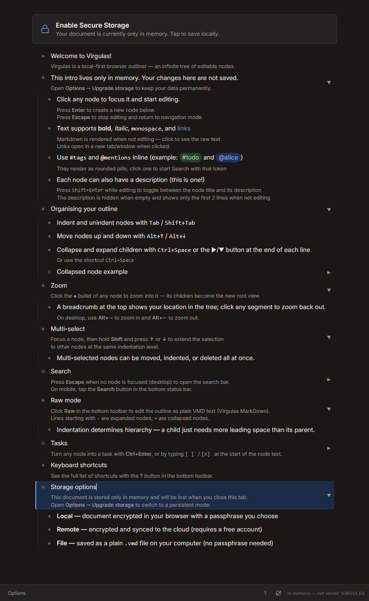

# Virgulas

[Virgulas](https://virgulas.com) is a local-first browser outliner: an infinite tree of notes you
can shape, zoom into, and turn into tasks — with optional end-to-end encrypted sync.



## Why Virgulas

- **Local-first.** The document lives in your browser (or in a file you own). Nothing is required
  to start: no account, no server, no sign-up.
- **Private by design.** Local and Remote documents are encrypted with AES-GCM-256 under a key
  derived from your passphrase. The server stores only ciphertext and cannot read your notes.
- **Keyboard-fast.** Every structural action — add, indent, move, collapse, zoom, search, toggle
  tasks — has a shortcut. The mouse is optional.
- **Works offline.** A service worker caches the app shell, so after the first load Virgulas opens
  without a network connection.
- **One document, any device.** File mode for something you own forever, Remote mode when you want
  it on every device, with a merge flow that never silently loses an edit.
- **No lock-in.** Documents are plain VMD text. Export a `.vmd` backup at any time; import it
  anywhere. Virgulas is public-domain software ([Unlicense](LICENSE)).

## Features

### Outlining

- Infinite list of editable nodes with recursive children
- Markdown rendering — bold, italic, links, images, inline code; links always open in a new tab
- A description is a full markdown document: zoom into its node for headings, lists,
  blockquotes, fenced code, rules, and tables; while browsing it stays a two-line preview
- Images never exceed the width of the note; long lines wrap instead of scrolling sideways
- Inline `#tags` and `@mentions` render as pills; clicking one opens Search prefilled
- Optional description per node, previewed while browsing and auto-growing while editing
- Collapse and expand (`Ctrl+Space` or the ▶/▼ control)
- Indent and outdent (`Tab` / `Shift+Tab`, or swipe right/left on touch)
- Move nodes among siblings (`Alt+↑` / `Alt+↓`)
- Multi-select siblings (`Shift+↑/↓`), then move, indent, collapse, or delete the group
- Zoom into any node (`Alt+→`) with clickable breadcrumbs; the URL carries the node ID so a zoom
  can be linked or reloaded, in every storage mode (Memory, Local, Remote, and File)
- Delete a node (`Ctrl+Backspace`, or `Backspace` on an empty node); deleting a subtree asks first
- `Enter` adds a sibling, or the first child when the node has visible children
- Paste plain text, or paste a multi-line/bulleted VMD fragment to create nodes

### Search

- Substring search over the whole document, with smart case (lowercase matches case-insensitively)
- Non-matching nodes are hidden and matches are highlighted
- Cycle results with `Tab`/`Shift+Tab` or `↑`/`↓`, open one with `Enter`
- Opening a result auto-zooms to its closest collapsed ancestor

### Tasks

- Any node can become a task: type `[ ] ` / `[x] `, or cycle with `Ctrl+Enter`
- Click the checkbox to toggle pending ↔ done
- Due dates via `due:yyyy-MM-dd` — rendered as a chip, overdue work is highlighted
- Recurrence via `rec:<n><y|m|w|d>` next to a due date; completing the task advances its date
- Tasks panel (`Ctrl+Alt+K` or the checklist button) groups Pending, Scheduled, and Done for the
  current zoom, with breadcrumb context and a day-window filter for scheduled work

### Quick capture

Capture text without opening the app:

- **Installed PWA:** long-press the icon → **Quick capture** (with its own inbox icon), or share
  text from another app through the Android share sheet
- **Automation:** open `/?quick-add=buy%20milk` from a tool like Tasker
- **Bookmarklet:** copy **Save to** from Options and click it on any page

A capture visit stays locked — no passphrase, no decryption, no network. Captures wait in a
device-local queue and are filed into your Inbox node on the next unlock. A shared page becomes a
`[title](url)` link with the highlighted text as its description.

Each entry point is listed inside the app under **Options → Quick capture**, where the Inbox node
name can also be changed.

### Storage and sync

Choose per device; your choice is remembered:

- **Memory** — first-visit mode. The document lives in JS memory, the built-in tour shows you
  around, and an **Enable Secure Storage** prompt appears when you are ready to keep your work.
- **Local** — encrypted in this browser with a passphrase. No account.
- **Remote** — encrypted and synced through Supabase. An account email/password controls access;
  a separate passphrase controls encryption, so the server never sees plaintext.
- **File** — open or create a plain `.vmd` file on disk (File System Access API). No encryption,
  saved back automatically after you pause typing.

Remote sync pulls before it pushes, merges per node, and resolves same-field conflicts with a
side-by-side "Keep local / Keep remote" dialog instead of guessing.

Other data tools: export/import `.vmd` backups, change your encryption passphrase, and enable
biometric unlock (fingerprint/face/device PIN) for this device.

### Interface

- Light/dark theme (`Ctrl+Alt+T`), persisted
- Wide mode (`Ctrl+Alt+W`) for large screens
- Status toolbar: storage mode, sync state, tasks, search, `?` shortcut reference, and Options
- `Escape` closes an open dialog (Options or shortcuts) instead of toggling search
- Mobile: larger touch targets, swipe to indent, keyboard-aware status bar
- Respects `prefers-reduced-motion` and shows visible keyboard focus rings everywhere
- With JavaScript disabled, shows an actionable message instead of leaving the splash on screen

## Privacy and security

- Documents are gzip-compressed and encrypted with AES-GCM-256 under a PBKDF2-HMAC-SHA256 key
  (600,000 iterations, per-document salt, fresh IV per write). Only salt + ciphertext leave the
  device. There is no recovery path for a forgotten passphrase.
- Rendered markdown is sanitised with an explicit allow-list (`class`, `id`, `style`, event
  handlers, and form controls are never allowed), and remote images load with
  `referrerpolicy="no-referrer"` and no event handlers.
- The only third-party script is an SRI-pinned analytics tracker; everything else is bundled. A
  strict Content-Security-Policy allow-lists exactly what the app can load.
- The quick-capture queue, theme, mode, timestamps, and username/email are stored unencrypted on
  the device; the document payload is the only ciphertext. The exact list lives in
  [`docs/SPEC.vmd`](docs/SPEC.vmd) → ENCRYPTION.

Open security work is tracked in [`docs/SECURITY.md`](docs/SECURITY.md). How to report a
vulnerability, and the accepted risks, are in `/.well-known/security.txt`.

## Run it locally

Requires [Bun](https://bun.sh) 1.4 or later (Node 20+ only to launch Playwright).

```bash
bun install
bun run dev     # builds dist/ and serves it
```

Tests:

```bash
bun run test       # unit + end-to-end
bun run typecheck  # strict TypeScript, app + tests
```

Local Playwright runs need local Supabase credentials; see
[`AGENTS.md`](AGENTS.md#database-setup). Everything else — architecture, bundling, the service
worker, database workflow, CI/CD, and the contribution rules — lives in [`AGENTS.md`](AGENTS.md).

## Documentation

| Document | What it covers |
| --- | --- |
| [`docs/SPEC.vmd`](docs/SPEC.vmd) | Normative feature and design-decision register |
| [`docs/VMD.md`](docs/VMD.md) | VMD plain-text format definition |
| [`docs/design.md`](docs/design.md) | Visual and interaction design system |
| [`docs/SECURITY.md`](docs/SECURITY.md) | Open security work |
| [`AGENTS.md`](AGENTS.md) | Contributor handbook: rules, setup, architecture, tests, CI |

## Standards

Virgulas follows [The Website Specification](https://specification.website) — a platform-agnostic
checklist of the technical features a good website should have. The compliance notes (edge
security headers, crawl and discovery files, the privacy and 404 pages, and the accessibility
baseline) live in [`docs/SPEC.vmd`](docs/SPEC.vmd) → SITE AND DISCOVERABILITY.

## License

Released into the public domain under the [Unlicense](LICENSE).
